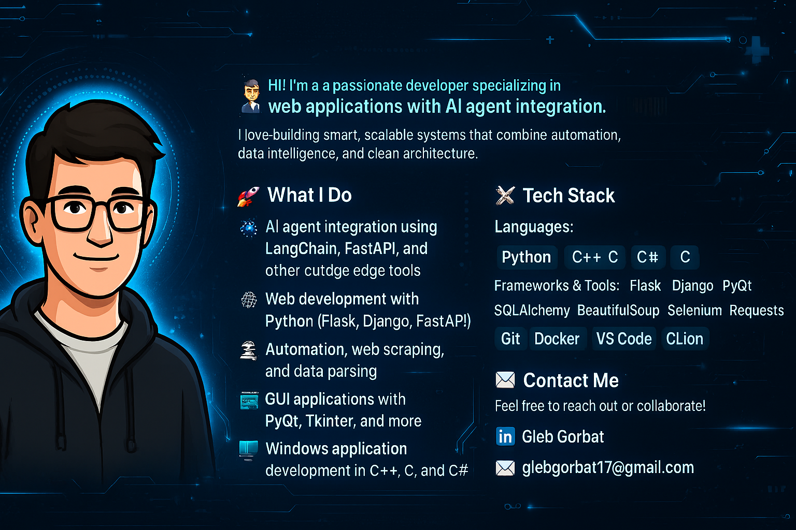

  

<h1 align="center">👨‍💻 Gleb Gorbat — AI-Powered Developer</h1>

  Passionate developer specializing in <strong>web applications with AI agent integration</strong>.  
  I build smart, scalable systems that combine automation, data intelligence, and clean architecture.

---

## 🚀 What I Do

- 🧠 AI agent integration using **LangChain**, **FastAPI**, and other cutting-edge tools  
- 🕸️ Web development with **Python** (Flask, Django, FastAPI)  
- 🤖 Automation, web scraping, and data parsing  
- 🗄️ Database design and interaction (PostgreSQL, MySQL, SQLite)  
- 🖥️ GUI applications with **PyQt**, **Tkinter**  
- 🪟 Windows application development in **C++**, **C**, and **C#**

---

## 🛠️ Tech Stack

### Languages
`Python` `C++` `C#` `C`

### Frameworks & Tools
`LangChain` `FastAPI` `Flask` `Django` `PyQt` `Tkinter`  
`SQLAlchemy` `BeautifulSoup` `Selenium` `Requests`  
`Git` `Docker` `VS Code` `CLion`

---

## 📁 Projects

> This repository contains portfolio-ready code samples, automation scripts, and AI-powered integrations.  
> Each project is designed with scalability, clarity, and real-world application in mind.

- 🔧 [MyProjects — Pet Projects Repository](https://github.com/GlebGorbat-dev/MyProjects)  
  A collection of personal experiments, prototypes, and automation tools built with Python, AI, and more.

---

## 📫 Contact Me

Feel free to reach out or collaborate!

- 🌐 [LinkedIn](https://www.linkedin.com/in/gleb-gorbat-53b54a393/)
- 📧 glebgorbat17@gmail.com

---

  <em>Built with ❤️ by Gleb Gorbat</em>

